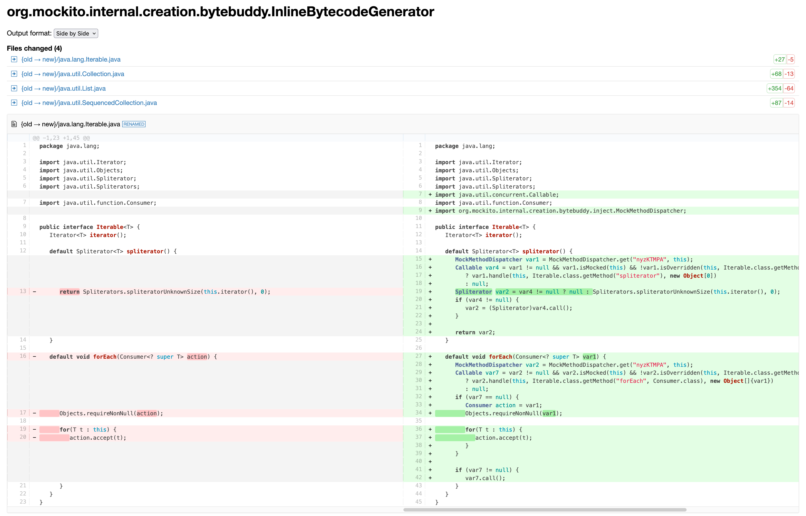
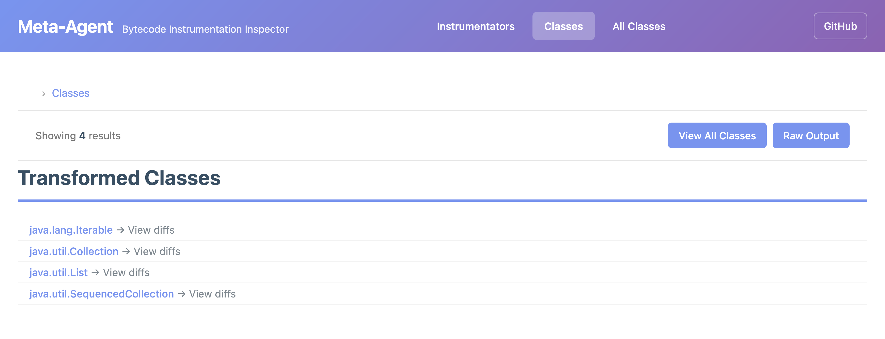

Meta-Agent
==========

Who instruments the instrumenter? This project is a Java agent that instruments Java agents,
or specifically, it instruments the ClassFileTransformers of other agents to observe how they transform
the bytecode of classes and can also capture native agents with the help of its [own](./native).

This is especially useful to check what libraries like [Mockito](https://site.mockito.org/),
Dynatrace or async-profiler's method trace do to your classes at runtime.

To run it, build the project with `mvn package -DskipTests` and run your Java program with the agent:

```shell
java -javaagent:target/meta-agent.jar -jar your-program.jar

# or run a Mockito based sample test
mvn package -DskipTests
mvn test -DargLine="-javaagent:target/meta-agent.jar=server"

# or run with an instrumentation handler
mvn -DargLine="-javaagent:target/meta-agent.jar=server,cb=me.bechberger.meta.LoggingInstrumentationHandler" test
```

The executed [MockitoTest](src/test/java/me/bechberger/meta/MockitoTest.java) looks as follows:

```java
@ExtendWith(MockitoExtension.class)
public class MockitoTest {

  @Mock
  List<String> mockedList;

  @Test
  public void whenNotUseMockAnnotation_thenCorrect() throws InterruptedException {
    mockedList.add("one");
    Mockito.verify(mockedList).add("one");
    assertEquals(0, mockedList.size());

    Mockito.when(mockedList.size()).thenReturn(100);
    assertEquals(100, mockedList.size());

    Thread.sleep(10000000L);
  }
}
```

If you also want to capture native agents, you can build the native part with
```
(cd native && make)
```
and then run with
```shell
# on Mac OS
java -agentpath:native/native_agent.dylib -javaagent:target/meta-agent.jar=server -jar your-program.jar
# on Linux
java -agentpath:native/native_agent.so -javaagent:target/meta-agent.jar=server -jar your-program.jar
```
More on this in the [native](native/README.md) README.

Opening [localhost](http://localhost:7071) will show you a list of available commands, most importantly
- [/help](http://localhost:7071) to show the help, available comands and decompilation and output options
- [/instrumentators](http://localhost:7071/instrumentators) to list all instrumentators (ClassFileTransformers) that have been used
- [/full-diff/instrumentator?pattern=.*](http://localhost:7071/full-diff/instrumentator?pattern=.*)
  to show the full diff for all instrumentators
- [/classes](http://localhost:7071/classes) to list all classes that have been transformed
- [/full-diff/class?pattern=.*](http://localhost:7071/full-diff/class?pattern=.*)
  to show the full diff for all classes and all instrumentators
- [/all/decompile?pattern=<pattern>](http://localhost:7071/all/decompile?pattern=<pattern>)
  to decompile the classes matching the pattern

In our example, we can see via [/instrumentators](http://localhost:7071/instrumentators) that Mockito uses
the `org.mockito.internal.creation.bytebuddy.InlineByteBuddyMockMaker` to transform classes.
Using [/full-diff/instrumentator/.*](http://localhost:7071/full-diff/instrumentator/.*), we can see the diff of all
transformations that this instrumentator has done:



Yet we also see via [/classes](http://localhost:7071/classes) that Mockito only transforms the `java.util.List` 
interface and all its parents:



The [LoggingInstrumentationHandler](src/test/java/me/bechberger/meta/LoggingInstrumentationHandler.java)
which is passed to the agent via the `cb` argument, logs all added and existing transformers.

It is implemented as follows:

```java
public class LoggingInstrumentationHandler implements InstrumentationCallback {
  @Override
  public CallbackAction onAddTransformer(ClassFileTransformer transformer) {
    System.err.println("New transformer " + transformer.getClass().getName());
    return CallbackAction.ALLOW;
  }

  @Override
  public void onExistingTransformer(ClassFileTransformer transformer) {
    System.err.println("Existing transformer " + transformer.getClass().getName());
  }

  @Override
  public CallbackAction onInstrumentation(ClassFileTransformer transformer, ClassArtifact before, ClassArtifact after) {
    return CallbackAction.ALLOW;
  }
}
```

The meta-agent can also be used via a [maven plugin](maven-plugin/README.md),
see the [sample project](maven-plugin-sample/README.md) for an example usage.
The maven plugin does not yet support the native agent.

How this works
--------------

The agent wraps all ClassFileTransformers with a custom transformer that records the diff of the bytecode.
It then uses [vineflower](http://vineflower.org/) to decompile the bytecode and 
[diff](https://www.gnu.org/software/diffutils/)
to compute the diff between the original and the transformed bytecode.

The front-end is implemented using the built-in HttpServer as a simple web server started by the agent.

This is essentially a more capable version of the [classviewer-agent](https://github.com/parttimenerd/classviewer-agent).-

Contributions
-------------
If you have sample programs where this tool helped to see something interesting, please share.
Contributions, issues and PRs are welcome.

Deploy
------
```shell
mvn package -DskipTests=true deploy -U
mvn package -f pom_runtime.xml -DskipTests=true deploy -U
```

License
-------
MIT, Copyright 2024 SAP SE or an SAP affiliate company, Johannes Bechberger
and meta-agent agent contributors